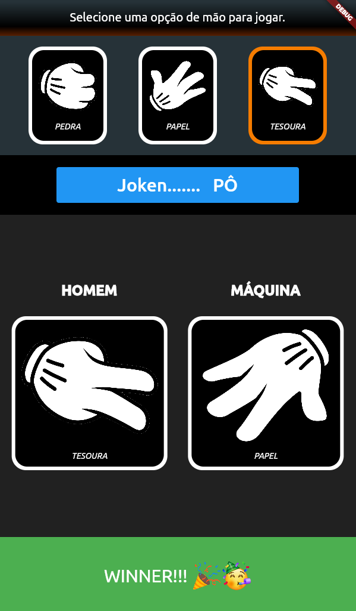
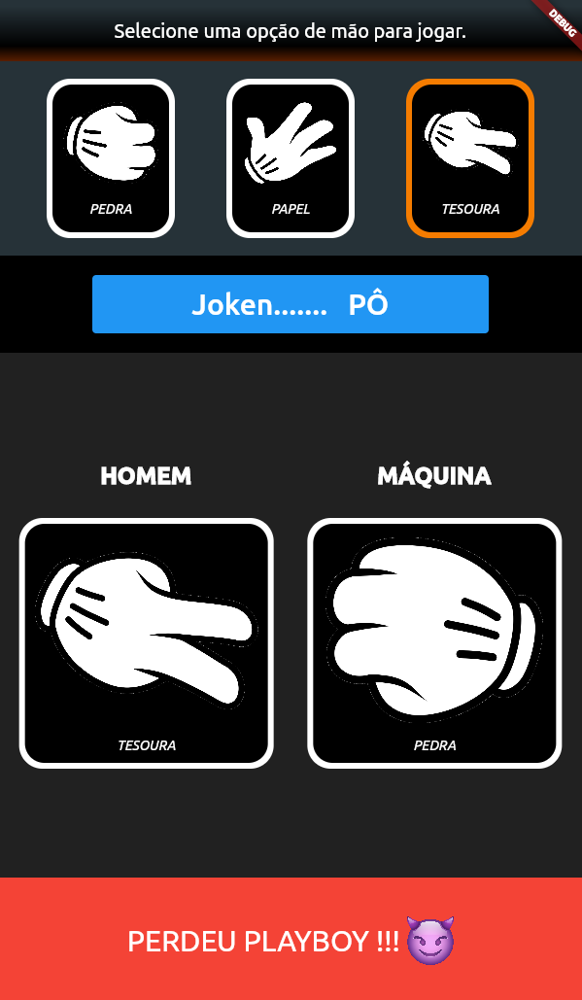
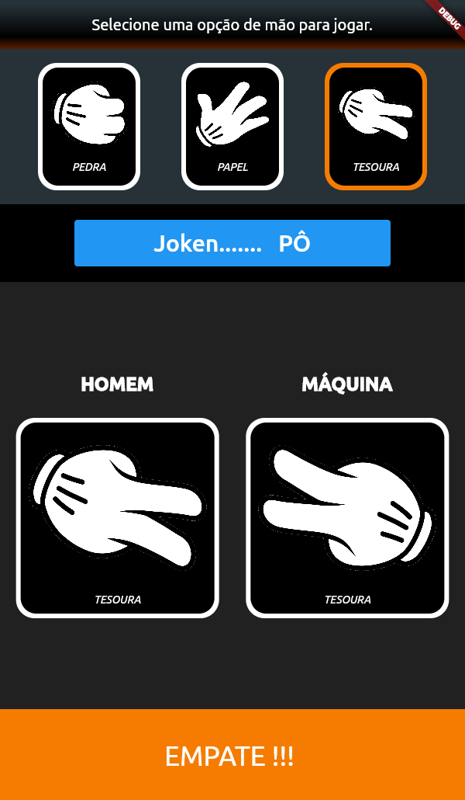

# jokenpo

Aplicativo mobile em Flutter do jogo pedra-papel-tesoura; ***joken...pô***.

### Contexto

5° semestre do curso Análise e Desenvovimento de Sitemas da Fatec/Rio Preto, disciplina de Programação de Dispositivos Móveis com o Professor Dr. Henrique Dezani. Após duas semanas de aulas em que vimos os widget do Flutter e algumas peculiaridades do Dart, o professor nos passou um desafio. 

> Desenvolva o jogo pedra-papel-tesoura, homem versus máquina. O usuário escolhe uma das três opções de mãos e a máquina faz um sorteio aleatório para escolher uma opção dentre as três. O app deverá apresentar o resultado: ganhou, perdeu ou empate.

:heavy_check_mark: Os códigos podem ser encontrados dentro da pasta :file_folder: lib.

## Modelagem

 Procuramos modelar o desafio usando a Orientação a Objetos. O Flutter trabalha muito com componentes gráficos, os _widget_. Então buscamos identificar os componentes gráficos passíveis de generalização e repetidos, a fim de usar a composição para aproveitamento de código, além de classes conceituais de backend.

 Ganhou  |  Perdeu | Empatou
:----------:|:----------:|:----------:
  |  |  

_Figura 1: Telas com os resultados possíveis_

 As classes de *backend* e de widgets visuais foram:

- **Mao** - atributo `destacada` é usado para colorir a que foi selecionada pelo usuário e o atributo `espelhada` é para fazer o reflexo da imagem da mão para que fique uma de frente a outra, como dois opositores jogando.

- **TipoMao** - é um enum para as constantes `PEDRA`, `PAPEL` e `TESOURA`.

- **MaoID** - usada na classe `FabricaMao` como atributos de classe (*static*) para encapsular o nome e o local da imagem (*asset*).

- **FabricaMao** - segue o padrão de projetos *Factory Methody* para instanciar objetos.

Com estas classes já podemos montar o widget `PainelOpcoes`, onde temos as três figuras com a opção "tesoura" destacada por ser a escolha do usuário. E também estas classes são usadas para montar o widget `Ringue`.

- **Ringue** - é o espaço da disputa, é onde os jogadores dão seus `Lance`\`s.

- **Lance** - é a aposta, o último movimento do jogador, onde homem ou máquina revela com qual mão escolheu jogar, se pedra, papel ou tesoura. 

- **FabricaLance** - *Factory Method* para criar objetos `Lance`, baseado no enum `TipoMao` e no enum `TipoJogador`, este último definido no prório arquivo .dart da fábrica de lances. O tipo de jogador é necessário para saber se precisaremos aplicar a transformação de reflexão na imagem, pois o jogador "máquina" fica a direita no ringue e a sua mão precisa estar espelhada.

- **TelaJogo** - é o principal widget, pois nele temos a composição de todos os demais widgets e as regras de negócio que controlam a renderização. Este widget armazena o estado da aplicação (*StatefulWidget*). 

Flutter tem alguns padrões e convenções de arquitetura que devemos respeitar. O estado do widget é encapsulado em um objeto criado com a sobreposição de método da classe mãe `StatefulWidget`. O tipo do objeto retornardo pelo método que sobrepôe (`createState`) deve ser um subtipo do tipo (`State`) retornado pela classe mãe. Ou seja, temos aqui um caso de ***Tipos de retorno covariantes***, onde o tipo de retorno do método que sobrepõe é uma subclasse do tipo retornado pelo método sobreposto.

Ficou confuso não!? Mas é simples, vamos mostrar um exemplo Java que ficará mais claro.

```java
class A {}

class B extends A {}

public class Covariant {
	
	public A getObject() {
		return new A();
	}
}

class SubCovariant extends Covariant {
	
	public B getObject() {
		return new B();
	}
}
```

O suporte dado por tipos de retorno covariantes irá permitir que o método que sobreponha um método da superclasse retorne qualquer subtipo  do tipo retornado pelo método da superclasse. 

No nosso caso, temos a seguinte correspondência com o nosso exemplo:
 Exemplo Java | Jokenpo Flutter |
:---|:---
Covariant  |  StatefulWidget 
SubCovariant  |  TelaJogo 
A  |  State
B  |  _TelaJogoState

Interessante notar como os arquitetos do Flutter amarraram a covariância utilizando *Generics* em `State<TelaJogo>`, fazendo um acoplamento forte pela tipagem entre o widget e o objeto que armazena seu estado. Na maioria das vezes procuramos evitar acoplamento, mas este é um caso plenamente justificável, e até desejável. Solução elegante.

- **_TelaJogoState** - possui apenas duas variáveis de estado, a `maoJogador` e a `maoComputador`, ambas valores de constantes do enum `TipoMao`. Os widgets `telaResultado` e `ringue` que iniciamos com telas vazias, serão atualizados em função do estado das mãos dos jogadores. Só precisou de três métodos para fazer o comportamento da aplicação:

  - **jokenpo()** - é o método invocado quando clicamos o botão azul. Nele usamos um objeto `Random` para sortear um número, que usaremos como índice do vetor de constantes `maos`. Este sorteio é usado para estabelecermos qual será a mão do computador. A mão do jogador é obtida do widget `painelOpcoes` e estará destacada com um contorno laranja.
  <br>A seguir, invocamos o método sobreposto `setState`, que invoca os outros dois métodos que controlam o comportamento: `updateRingue` e `setResultado`. Pode parecer estranho este `setState`, mas ao que parece ele faz parte de um *Template Method* chamado em algum momento na arquitetura quando for construir a árvore de widget; é a forma do Flutter trabalhar.

  ```dart
  var maos = [TipoMao.PEDRA, TipoMao.PAPEL, TipoMao.TESOURA];

  void jokenpo() {
    Random random = Random();
    int numeroSorteado = random.nextInt(3);
    this.maoComputador = maos[numeroSorteado];
    this.maoJogador = painelOpcoes.maoSelecionada;

    setState(() {
      updateRingue();
      setResultado(this.maoJogador, this.maoComputador);
    });
  }

  ```
  
  - **updateRingue()** - recria o widget `Ringue` passando no construtor o estado das mãos do jogador e do computador.
  
  ```dart
  void updateRingue() {
    ringue = Ringue(
      maoJogador: this.maoJogador, 
      maoComputador: this.maoComputador
    );  
  }

  ```
  - **setResultado()** - atualiza o widget inferior informando o resultado do jogo. O `empate` é o resultado mais simples e é o primeiro a ser checado. Se não for confirmado, só nos restará `ganhou` ou `perdeu`.

  ```dart
  void setResultado(TipoMao? maoJogador, TipoMao? maoComputador) {
    if (maoJogador == maoComputador) {
      telaResultado = empate; 
      return;
    }

    if (maoJogador == TipoMao.PAPEL) {
      telaResultado = maoComputador == TipoMao.PEDRA   ? ganhou : perdeu;       
    }
    else if (maoJogador == TipoMao.PEDRA) {
      telaResultado = maoComputador == TipoMao.TESOURA ? ganhou : perdeu;       
    }
    else if (maoJogador == TipoMao.TESOURA) {
      telaResultado = maoComputador == TipoMao.PAPEL   ? ganhou : perdeu;       
    }
  }  
  ```
E assim fizemos o desafio do Dezani. Obrigado Professor.!
